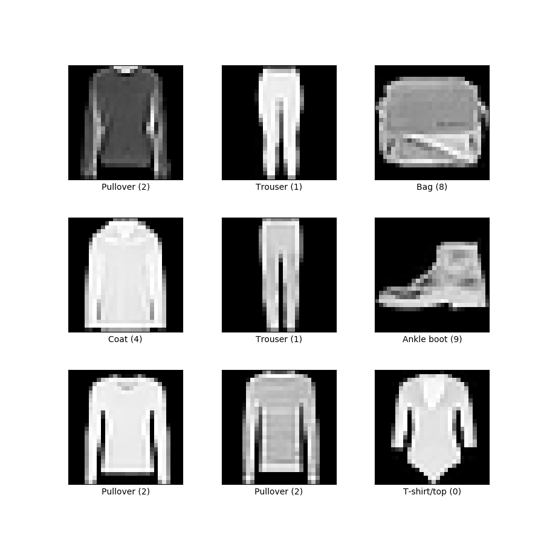

# Project Fashion

This project is a simple implementation of a Convolutional Neural Network (CNN) to classify images of clothing from the Fashion-MNIST dataset.



## Key Requirements
Matplotlib
Numpy
Pandas
Python 3.10.6
Scikit-learn
Tensorflow

## Installation
You can install all the required packages by running:
**this is an example only!! Please DO NOT INSTALL**

```pip install -r requirements.txt``` 

## Usage
The main script is fashion.py which contains the Fashion class. The class provides the following functions:

- **load_data()**: loads the data from the Fashion-MNIST dataset and splits it into train and test sets.
- **transform_data()**: normalises and reshapes the data, and converts the labels to categorical format.
- **get_data()**: returns the train and test sets.
- **build_model()**: builds and returns a CNN model.
You can use the class to train and evaluate the model by running:

```python lib.py```

This script will load the data, preprocess it, train the model and evaluate it on the test set. It will also save the model in the models folder.

## Evaluation
The script will output the accuracy of the model on the test set.
If you want to run the unit test cases, use the command:

```python -m unittest test_fashion.py```

## Note
The script is using a fixed *random_state* (42) for splitting the data and for the model initialisation, if you want to change the random_state, you can do it by passing the parameter to the Fashion class, inside the load_data function.

## Contributions
Pull requests and bug reports are welcome.

## License
This project is licensed under the MIT License.

## Acknowledgments
This project is inspired by the TensorFlow tutorials and the Fashion-MNIST dataset.
